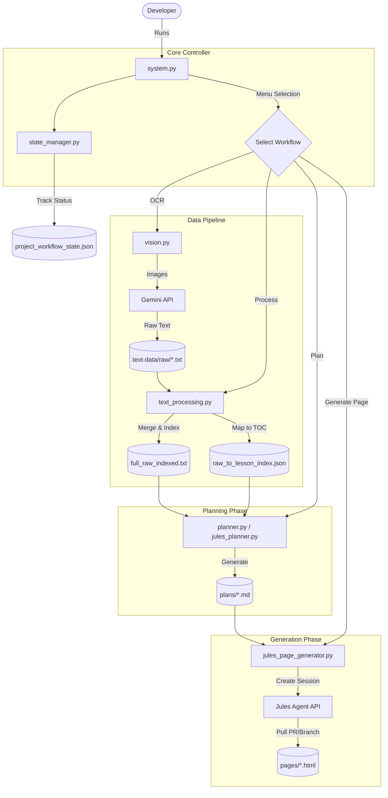

# How the Arabic Grammar Automation System Works

This document provides a comprehensive technical overview of the automation system used to generate the Arabic Grammar Book. It is designed for junior developers and contributors to understand the architecture, workflows, and key components of the codebase.

## 1. Introduction

The core purpose of this system is to automate the transformation of raw educational content (images of Arabic grammar lessons) into structured HTML pages for the book. The system handles the entire pipeline:

1.  **Ingestion (OCR):** Extracting text from images.
2.  **Processing:** Cleaning, merging, and indexing the raw text.
3.  **Planning:** Generating structured lesson plans (Architect phase).
4.  **Generation:** Converting plans into HTML pages (Developer phase).
5.  **Audit:** verifying the output against design rules.

The system is built in Python and relies heavily on **Google's Gemini models** (via `GeminiClient`) and **Jules (Code Assist) Agents** (via `JulesClient`).

---

## 2. System Architecture

The system follows a modular architecture centered around a main controller (`system.py`) and specialized worker modules.



---

## 3. Directory Structure

Understanding the file layout is crucial for navigating the code.

| Directory / File | Description |
| :--- | :--- |
| **`system.py`** | **The Main Entry Point.** Run this script to start the CLI. |
| **`system workspace/`** | Contains core logic, tools, and temporary data. |
| `├── tools/automation/modules/` | **The Brain.** Contains all Python classes (`vision.py`, `planner.py`, etc.). |
| `├── text-data/` | Stores intermediate text files (`raw/`, `full_raw_indexed.txt`). |
| `├── project_workflow_state.json` | **Database.** Tracks the status of every lesson. |
| **`input/`** | Place source images here (e.g., `01.jpg`). Contains `TOC.json`. |
| **`plans/`** | Generated Markdown lesson plans live here. |
| **`pages/`** | Final HTML pages live here. |
| **`Jules workspace/Templates/`** | HTML templates (`TEMPLATE_C_BASE.html`) used by the generator. |

---

## 4. Key Modules & Workflows

### 4.1. The Controller: `system.py`
*   **Role:** The command center. It initializes the UI (using the `rich` library) and routes user commands to specific modules.
*   **Key Function:** `main()` loop displaying the `questionary` menu.
*   **Dependencies:** Imports all modules from `system workspace/tools/automation/modules`.

### 4.2. State Management: `state_manager.py`
*   **Role:** The "Database" of the project. It persists the progress of each lesson.
*   **Data Store:** `project_workflow_state.json`.
*   **Schema:**
    ```json
    "lessons": {
      "01 - Introduction": {
        "status": "PLAN_READY",
        "files": { "raw": "...", "plan": "...", "html": "..." },
        "last_updated": 1715000000
      }
    }
    ```
*   **Key Methods:**
    *   `update_lesson_status(title, status, files)`: Updates the JSON file.
    *   `get_consolidated_state()`: Merges duplicate entries and sorts lessons.

### 4.3. Phase 1: Ingestion (`vision.py`)
*   **Role:** Converts images in `input/` to text.
*   **Tool:** Uses `VisionClient` which wraps `GeminiClient`.
*   **Process:**
    1.  Scans `input/*.jpg`.
    2.  Sends images to Gemini Pro Vision with a strict system prompt ("Transcribe EXACTLY...").
    3.  Saves output to `system workspace/text-data/raw/raw_{filename}.txt`.
*   **Why Gemini?** Standard OCR engines struggle with Arabic diacritics (Harakat). Gemini Vision is far more accurate.

### 4.4. Phase 2: Text Processing (`text_processing.py`)
*   **Role:** Prepares the raw text for the AI Architect.
*   **Key Operations:**
    1.  **Merge (`merge_raw_text`):** Combines all `raw_*.txt` files into one huge file (`full_raw_indexed.txt`) with line numbers (e.g., `[raw_01.txt:5] Content`).
    2.  **Index (`generate_lesson_index`):** Uses Gemini to read the merged text and the `TOC.json` (Table of Contents). It outputs `raw_to_lesson_index.json`, mapping each lesson title to a specific start/end line in the raw text.

### 4.5. Phase 3: Planning (`planner.py` vs `jules_planner.py`)
This is where the "Architect" AI designs the lesson. There are two modes:

#### A. Standard Planner (`planner.py`)
*   **Method:** Direct LLM Call.
*   **Tool:** `GeminiClient` (Headless).
*   **Process:** Sends the raw text + `Architect_GEM_MASTER.md` prompt to Gemini and saves the response as a Markdown file.
*   **Pros:** Fast, cheap.
*   **Cons:** Cannot self-correct or browse the web.

#### B. Jules Planner (`jules_planner.py`) - **Recommended**
*   **Method:** Agentic Session.
*   **Tool:** `JulesPlanClient` (wraps `JulesClient`).
*   **Process:**
    1.  Creates a **Jules Session** (Google Code Assist).
    2.  Sends a "Mega Prompt" containing the text, the Architect Persona, and the Auditor Rules.
    3.  **Agent Interaction:** The agent (Jules) creates a plan, reviews it against the rules (Auditor), and refines it.
    4.  **Pull:** The agent commits the plan to a Git branch. The script pulls this file locally.
*   **Key Class:** `JulesPlanner` manages thread pools to process multiple lessons in parallel.

### 4.6. Phase 4: Page Generation (`jules_page_generator.py`)
*   **Role:** The "Developer" AI. Converts Markdown plans into HTML.
*   **Tool:** `JulesPageGenerator`.
*   **Process:**
    1.  Reads the Plan (`.md`).
    2.  Creates a **Jules Session** with instructions to use `Jules workspace/Templates/`.
    3.  **Monitoring Loop:**
        *   Checks session status every 30s.
        *   **Interactive Q&A:** If Jules asks a question (e.g., "Where is the CSS file?"), the script captures it, sends it to a "Headless Gemini" (who has context of the repo), and feeds the answer back to Jules.
    4.  **Completion:** Once Jules finishes, the script pulls the generated HTML file from the remote branch to `pages/`.

---

## 5. Key Classes & Variables

### `JulesClient` (`jules_client.py`)
*   **Purpose:** The bridge to the Google Jules API.
*   **Key Methods:**
    *   `create_session(prompt)`: Starts a new coding session.
    *   `wait_for_completion(session_id)`: Polls until the agent finishes.
    *   `send_response(session_id, message)`: Replies to the agent.

### `GeminiClient` (`gemini_client.py`)
*   **Purpose:** Direct interface to Google Gemini models (for OCR, text processing, and answering Jules' questions).
*   **Configuration:** Requires `JULES_API_KEY` (or `secrets/Jules_API.txt`).

### `PROJECT_ROOT`
*   **Definition:** `Path(__file__).parent...`
*   **Importance:** All file paths are relative to this constant. This allows the tools to run from anywhere, but they assume a specific repo structure.

---

## 6. Configuration & Troubleshooting

### Setup Requirements
1.  **API Key:** You must have a valid Google Cloud API Key with access to Jules/Gemini.
    *   Place it in `secrets/Jules_API.txt` or set `JULES_API_KEY` env var.
2.  **Dependencies:** `pip install rich questionary requests` (plus others in `requirements.txt`).

### Common Issues
*   **"Missing UI libraries":** Run `pip install rich questionary`.
*   **"TOC file not found":** Ensure `input/TOC.json` exists and is valid JSON.
*   **"Session Timeout":** If Jules takes too long (>25 mins), the script might timeout. Check the console for "TIMEOUT".
*   **"Pull Failed":** Ensure you have `git` installed and your repo is clean. The tool tries to fetch branches created by the agent.

### Developer Tips
*   **Debugging:** Use the `debuging/` folder (created by some scripts) to inspect intermediate prompts.
*   **Logs:** The `system.py` UI uses `rich` for pretty printing. Errors are usually red, warnings yellow.
*   **Extending:** To add a new tool, create a class in `modules/` and import it in `system.py`.

---

**Happy Coding!** 🚀
